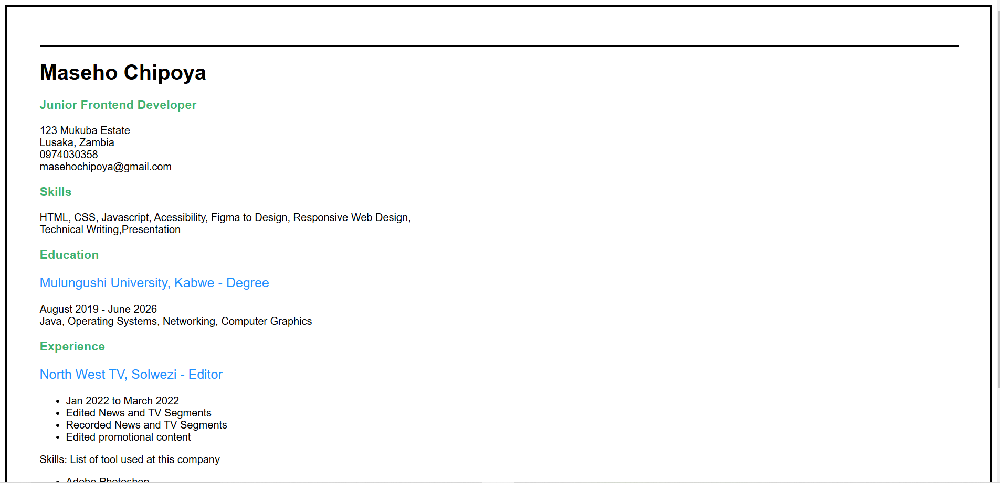

# RoadMap.sh - Single Page CV

This is a solution to the [Single Page CV project of the frontend path  on Roadmap.sh](https://roadmap.sh/projects/single-page-cv). Roadmap projects help you improve your coding skills by building realistic projects. 

## Table of contents
  - [Screenshot](#screenshot)
  - [Links](#links)
  - [Built with](#built-with)
  - [Useful resources](#useful-resources)
- [Author](#author)

### Screenshot

### Links

- Live Site URL: [Add live site URL here](https://your-live-site-url.com)

### Built with

- Semantic HTML5 markup
- Inline CSS

### Useful resources

-  - This helped me with finding appropriate html tags.

## Author

- Hashnode - [Maseho's blog](https://masehochipoya.hashnode.dev/)
- Linkedin - [Maseho Chipoya](https://www.linkedin.com/in/maseho-chipoya/)
